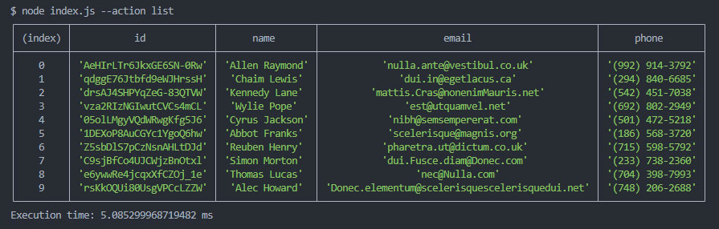
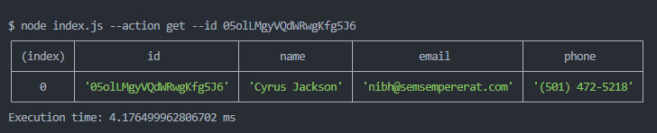
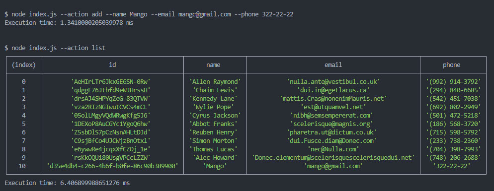
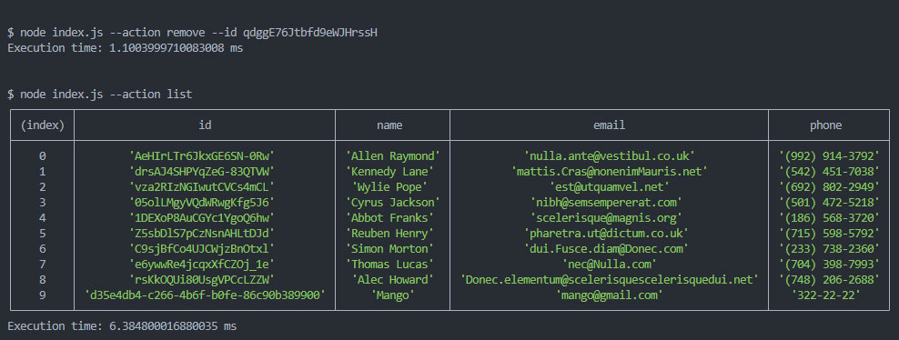

# Node.js module - CLI Application

Task completed during the GoIT Fullstack Developer course. It's a simple CLI application that allows to manage contacts stored in JSON file.

### Usage

#### Receive and output the entire contact list as a table

node index.js --action list

#### Get contact by id

node index.js --action get --id 05olLMgyVQdWRwgKfg5J6

#### Add new contact

node index.js --action add --name Mango --email mango@gmail.com --phone 322-22-22

#### Delete contact

node index.js --action remove --id qdggE76Jtbfd9eWJHrssH

### Screenshots

#### List

#### Get

#### Add

#### Delete

### Technologies

- JavaScript
  
- Node.js
  
